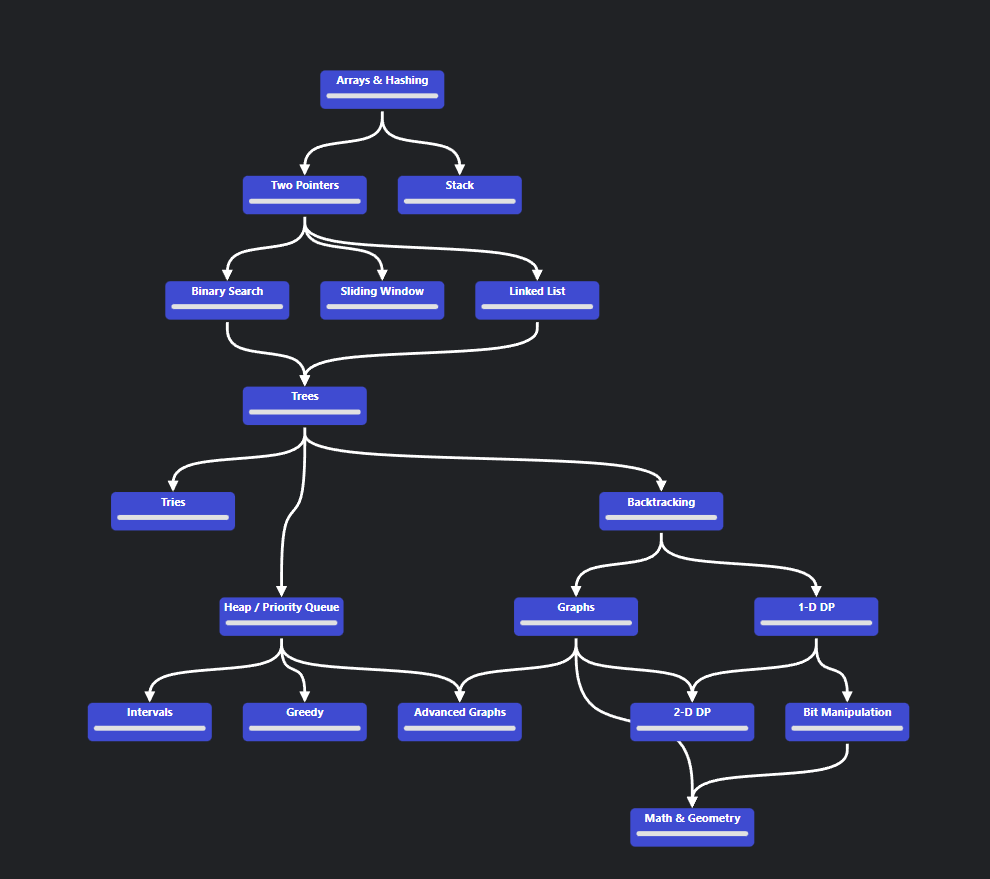

# Как алгоритмы влияют на разработчика?
**Проект-отчёт для конференции [Название конференции] | Автор: Щеголев Максим Антонович, Java/Kotlin-разработчик**

---

## Резюме проекта

Этот репозиторий документирует целенаправленный путь по системному развитию аналитического и алгоритмического мышления
через решение ключевых 75 задач с платформы [NeetCode](https://neetcode.io/).

**Уникальность подхода:** Челендж выполняется не студентом, а практикующим Java-разработчиком, что позволяет оценить
прикладную ценность алгоритмов в реальной индустрии. Основной акцент — не на количестве решённых задач, а на глубине
понимания, чистоте реализации и формировании устойчивых ментальных паттернов для решения сложных проблем.

## Стратегические цели

Проект решает несколько ключевых задач профессионального развития:

1. **Паттерны мышления:** Научиться быстро идентифицировать тип задачи (Sliding Window, Two Pointers, BFS/DFS) и
   применять соответствующий шаблон решения.
2. **Интуиция по структурам данных:** Чётко понимать, в какой проблемной ситуации `HashSet` предпочтительнее `HashMap`,
   когда нужен `PriorityQueue`, а когда достаточно массива.
3. **Качество индустриального кода:** Писать на Java не просто "рабочее", но эффективное, читаемое и сопровождаемое
   решение с учётом лучших практик.
4. **Оценка сложности:** Привычка автоматически анализировать Time & Space Complexity предлагаемого алгоритма.
5. **Уверенность в коммуникации:** Главный критерий успеха — способность ясно и структурированно **объяснить решение
   коллеге**, что критично как для работы в команде, так и для технических собеседований.

## Методология и дорожная карта

Движение идёт последовательно по тематическим блокам NeetCode 75, от базовых к продвинутым:

Каждой задаче посвящён отдельный файл с полным анализом.

## Структура репозитория и стандарт документации

Проект организован по тематическим разделам NeetCode 75:

- **src/** - корневая директория с исходным кодом
    - **01_arrays_hashing/** - задачи по массивам и хэшированию
        - **01_two_sum/** - каждая задача в отдельной папке
            - `Solution_Java.java` - чистая, комментированная реализация на Java
            - `Solution_Kotlin.kt` - чистая, комментированная реализация на Kotlin
            - `NOTES_Java.md` - подробный анализ решения для Java версии
            - `NOTES_Kotlin.md` - подробный анализ решения для Kotlin версии
        - **02_contains_duplicate/** - следующая задача
    - **02_two_pointers/** - задачи с техникой двух указателей
    - **03_sliding_window/** - задачи с техникой скользящего окна
    - ... и так далее по всем темам

### Стандарт для каждой задачи (файл `NOTES_Language.md`):

1. **Формулировка:** Краткое описание задачи и ссылка на LeetCode.
2. **Исходные данные:** Ограничения (constraints) и примеры.
3. **Мышление вслух:** Пошаговый ход мыслей — почему отбросил наивный метод, какой паттерн увидел.
4. **Выбранный подход:** Подробное текстовое описание алгоритма.
5. **Анализ сложности:**
    * **Временная сложность (Time Complexity):** `O(?)` и обоснование.
    * **Пространственная сложность (Space Complexity):** `O(?)` и обоснование.
6. **Альтернативы:** Какие другие подходы существуют и почему они менее эффективны.
7. **Ключевые выводы:** Главный инсайт из задачи (например: "Для проверки существования за `O(1)` почти всегда
   используется `HashSet`").

## Тезисы для конференции

На основе данного проекта планируется выступление, раскрывающее следующие тезисы:

* **"Алгоритмы — это не для собеседований, а для ясности мысли"** — как тренировка на LeetCode структурирует подход к
  проектированию систем на работе.
* **Из разработчика в человека, который может объяснить код решения:** Как метрика "умение объяснить коллеге" радикально
  меняет глубину понимания задачи.
* **Паттерны как язык:** Умение называть подход (например, "Sliding Window") ускоряет коммуникацию в команде в разы.
* **Практический результат:** Конкретные примеры, когда знание алгоритмов и структур данных помогло оптимизировать или
  исправить реальный рабочий код.

## Прогресс и метрики

Главная метрика успеха — **качество объяснения**. Прогресс фиксируется в таблице ниже.

| № | Задача        | Категория        | Статус                      | Дата       | Уровень объяснения* |
|---|---------------|------------------|-----------------------------|------------|---------------------|
| 1 | Two Sum       | Arrays & Hashing | ✅ Решено, задокументировано | 2023-10-26 | 5/5                 |
| 2 | Valid Anagram | Arrays & Hashing | ✅ Решено, задокументировано | 2023-10-27 | 4/5                 |

> *Уровень объяснения — субъективная оценка от 1 до 5, насколько чётко и просто я могу сейчас изложить суть решения.

---

## Как использовать этот репозиторий

1. **Для участников конференции:** Изучите структуру документации к любой задаче. Это пример того, как можно подходить к
   решению проблем глубоко, а не поверхностно.
2. **Для разработчиков:** Код и заметки открыты для обсуждения. Если видите возможность оптимизации или более изящное
   решение на Java — welcome to Issues или Pull Requests.
3. **Для школьников/студентов:** Этот проект — доказательство, что совмещать работу и системное самообразование реально.
   Берите за основу методологию, адаптируйте под свой язык.

**Лицензия:** Данный репозиторий является открытой документацией образовательного пути. Код и заметки можно свободно
использовать с указанием авторства.

---
*Путь в тысячу миль начинается с первого шага. А путь к сложным системам — с первого Two Sum.*``